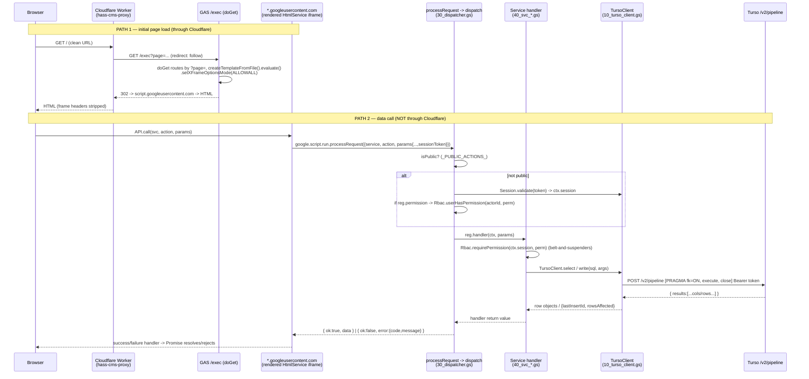

# Hass CMS — Architecture Document

**Repo:** `wmurikah/hass_crm_script`  ·  **App:** Hass CMS v4.0.0 (`00_constants.gs:186`)  ·  **Runtime:** Google Apps Script (V8), data in Turso/libSQL.

This document was written by reading the source. Where the repo cannot answer a question (e.g. the live DB schema), it is flagged explicitly rather than guessed.

## 0. System-context claims — verified / corrected

| Claim | Verdict | Evidence |
|---|---|---|
| Backend runs on GAS, deployed as a web app at a `/exec` URL | **Confirmed** | `appsscript.json` `"webapp": { executeAs: USER_DEPLOYING, access: ANYONE }`; `30_router.gs` `doGet`/`doPost` |
| Data lives in Turso (libSQL), accessed via a `TursoClient` HTTP helper | **Confirmed** | `10_turso_client.gs` is "sole owner of all `/v2/pipeline` HTTP calls"; creds `TURSO_URL`/`TURSO_TOKEN` from Script Properties |
| GitHub repo is source of truth; files synced into the GAS editor via the GAS GitHub Assistant Chrome extension (files only, not deployments) | **Confirmed (by design + docs)** | `Publish.gs` header: "Pull the latest code into the editor with the GitHub Assistant extension" then run a publish step; the extension moves *files*, deployment is a separate action |
| A Cloudflare Worker fronts the `/exec` URL for a clean entry URL | **Confirmed, with an important nuance** | `cloudflare-proxy/worker.js` + `wrangler.toml` (`name = "hass-cms-proxy"`); the **committed** worker is a *proxy*, but `docs/index.html` describes a *redirect* worker at the same hostname — see §6 |

Two corrections worth stating up front:

- **The "`setRoles` silent wipe" bug is, in the current code, already fixed.** `_usersSetRoles_` now validates a non-empty, known role set *before* it deletes anything and throws loudly otherwise (`40_svc_users.gs:231-259`; see commit `c366aaa`). Details in §3.
- **The canonical schema is not in the repo.** `001_rebuild_schema.sql` contains only the `sessions` table — and even that disagrees with the session code. Relationships in §4 are *inferred from the SQL in the handlers*. See the flag in §4/§9.

---

## 1. Request lifecycle, end to end

There are **two distinct entry paths**, and conflating them is the single most important thing to understand about this app:

1. **Initial page load** (`GET`) — goes through Cloudflare → GAS `doGet`.
2. **All data calls** — go through `google.script.run.processRequest(...)`, the GAS-native RPC, **directly to `*.googleusercontent.com` — NOT through Cloudflare and NOT through `doPost`.**

`doPost` exists (`30_router.gs:72`) and also funnels into `processRequest`, but the in-repo client never uses it — the UI client (`js_api.html`) calls `google.script.run.processRequest`. `doPost` is effectively a latent HTTP/JSON entry point (it would matter only if you moved the client to `fetch()` as the worker README suggests).



**Where auth/session/RBAC happen in the chain:**

| Stage | Code | What happens |
|---|---|---|
| Session gate | `30_dispatcher.gs:33-50` | If `service.action` not in `_PUBLIC_ACTIONS_`, pull `sessionToken` from `params` or `ctx`; `NO_SESSION` if absent; `Session.validate(token)` -> `SESSION_INVALID` if bad; else set `ctx.session`. |
| Session validation | `20_session.gs:71-104` | SHA-256 the token, look up `sessions` where `token_hash=? AND is_active=1 AND datetime(expires_at) > datetime('now')`; bump `last_activity_at`. |
| RBAC gate (dispatcher) | `30_dispatcher.gs:57-73` | If `reg.permission` declared, `Rbac.userHasPermission(actorId, perm)`; on fail, audit `PERMISSION_DENIED` and return `PERMISSION_DENIED`. |
| RBAC gate (handler) | e.g. `40_svc_users.gs:11` | Most handlers *also* call `Rbac.requirePermission(ctx.session, perm)` (throws `Errors.PermissionDenied`). Redundant with the dispatcher but defensive. |
| Errors -> response | `30_dispatcher.gs:78-81` | Handler throws are caught; `{ ok:false, error:{ code:e.code||'HANDLER_ERROR', message } }`. |

The **authoritative gate is the dispatcher's `reg.permission`** (declared at registration). Handler-level `requirePermission` is a second line of defense; a few handlers (e.g. `_authGetStaffInfo_`) rely solely on the dispatcher.

---

## 2. The dispatcher and service registry

**Files:** `30_dispatcher.gs` (registry + dispatch + `processRequest`), service files `40_svc_*.gs`, plus `AIService.gs` (registers `tickets.classifyTicket`).

### Pattern

- **`register(opts)`** (`30_dispatcher.gs:14`): stores `opts` in `_registry_[service + '.' + action]`. Each `opts` is `{ service, action, permission, handler }`. It lazily re-inits `_registry_` to survive any file load-order surprise.
- **`_registry_`** (`30_dispatcher.gs:12`): a flat map keyed by the dotted **`service.action`** name.
- Each service file ends with an IIFE like `(function _registerUsers_(){ register({...}); ... })();` so registration runs at file load (`40_svc_users.gs:263`).
- **`dispatch(ctx, req)`** (`30_dispatcher.gs:27`): resolves `key = service + '.' + action`, runs the public/session/permission gates (§1), then `reg.handler(ctx, params)` wrapped in try/catch, returning `{ok:true,data}` or `{ok:false,error}`.
- **`processRequest(body)`** (`30_dispatcher.gs:84`): parses JSON or object, builds `ctx = { sessionToken }`, calls `dispatch`. This is the function the client invokes via `google.script.run.processRequest`.

### `_PUBLIC_ACTIONS_` (auth bypass)

`dispatch` skips the session gate when `key` is in `_PUBLIC_ACTIONS_`. **There are two conflicting definitions** (a real gotcha — see §9):

- `30_dispatcher.gs:6`: `auth.login, auth.signup, auth.verifyAccount, auth.requestPasswordReset, auth.verifyOtp, auth.setNewPassword, system.health, system.ping`
- `40_svc_auth.gs:71`: the same minus `system.health`/`system.ping`.

Because GAS loads files in filename order and `40_svc_auth.gs` loads after `30_dispatcher.gs`, the **auth-file definition wins**, so `system.ping`/`system.health` are *not* actually public despite `40_svc_system.gs:8` claiming "ping (public via dispatcher)". (A third list, `_PUBLIC_ENDPOINTS_` in `30_router.gs:22`, is unused by `dispatch`.)

### Wiring a new action

1. Write a handler `function _fooBar_(ctx, params) { ... }` in a `40_svc_foo.gs` file.
2. In that file's registration IIFE: `register({ service:'foo', action:'bar', permission:'foo.manage', handler:_fooBar_ });`
3. If it must be reachable without a session, add `'foo.bar'` to `_PUBLIC_ACTIONS_` (both copies, to be safe).
4. The client calls it via `API.call('foo','bar', {...})` — no client-side routing table needed.

### Registered services & actions (27 namespaces, ~145 actions)

> `permission` is the declared gate. `null` = no permission check (but still session-gated unless public). `*` wildcard (SUPER_ADMIN) passes any check.

**Auth & identity**

| service.action | permission | service.action | permission |
|---|---|---|---|
| `auth.login` ¹ | null | `users.list` | `user.view` |
| `auth.logout` | null | `users.get` | `user.view` |
| `auth.signup` ¹ | null | `users.create` | `user.create` |
| `auth.verifyAccount` ¹ | null | `users.update` | `user.update` |
| `auth.requestPasswordReset` ¹ | null | `users.lock` | `user.update` |
| `auth.verifyOtp` ¹ | null | `users.unlock` | `user.update` |
| `auth.setNewPassword` ¹ | null | `users.resetPassword` | `user.reset_password` |
| `auth.mfaEnrollStart` | null | `users.invite` | `user.create` |
| `auth.mfaEnrollVerify` | null | `users.setRoles` | `role.assign` |
| `auth.mfaVerify` | null | `rbac.listRoles` | `order.manage` |
| `auth.me` | null | `rbac.getRole` | `order.manage` |
| `auth.getStaffInfo` | `user.view` | `rbac.listPermissions` | `order.manage` |
| `contacts.list` | `contacts.manage` | `rbac.assignRole` | `role.assign` |
| `contacts.get` | `contacts.manage` | `rbac.updateRole` | `role.assign` |
| `contacts.create` | `contacts.manage` | `rbac.createRole` | `role.assign` |
| `contacts.update` | `contacts.manage` | | |
| `contacts.setPortalRole` | `contacts.manage` | | |
| `contacts.deactivate` | `contacts.manage` | | |

¹ public via `_PUBLIC_ACTIONS_`.

**Sales / commerce**

| service.action | permission | service.action | permission |
|---|---|---|---|
| `customers.list` | `customers.view` | `orders.list` | `order.view` |
| `customers.get` | `customers.view` | `orders.get` | `order.view` |
| `customers.create` | `customers.create` | `orders.create` | `order.create` |
| `customers.update` | `customers.edit` | `orders.addLine` | `order.create` |
| `customers.softDelete` | `customers.edit` | `orders.submit` | `order.create` |
| `customers.search` | `customers.view` | `orders.approve` | `order.approve_low` |
| `customers.customer360` | `customers.view` | `orders.reject` | `order.approve_low` |
| `customers.setCredit` | `customers.set_credit` | `orders.cancel` | `order.cancel` |
| `catalog.listProducts` | `order.view` | `orders.dispatch` | `order.dispatch` |
| `catalog.getProduct` | `order.view` | `orders.confirmDelivery` | `order.confirm_delivery` |
| `catalog.listDepots` | `order.view` | `approvals.inbox` | `order.approve_low` |
| `catalog.listPriceLists` | `order.view` | `approvals.list` | `order.view` |
| `catalog.getPriceListItems` | `order.view` | `approvals.get` | `order.view` |
| `catalog.listSegments` | `customer.view` | `approvals.approve` | `order.approve_low` |
| `pricing.listLists` | `order.view` | `approvals.reject` | `order.approve_low` |
| `pricing.getPriceListItems` | `order.view` | `invoices.list` | `invoice.view` |
| `pricing.createList` | `invoice.generate` | `invoices.get` | `invoice.view` |
| `pricing.upsertItem` | `invoice.generate` | `invoices.generate` | `invoice.generate` |
| `pricing.deactivateList` | `invoice.generate` | `invoices.cancel` | `invoice.cancel` |
| `pricing.updateList` | `invoice.generate` | | |
| `pricing.deleteItem` | `invoice.generate` | | |
| `pricing.previewResolve` | `order.view` | | |
| `delivery_locations.list` | `customer.view` | `payments.upload` | `invoice.view` |
| `delivery_locations.get` | `customer.view` | `payments.approve` | `invoice.generate` |
| `delivery_locations.create` | `customer.manage` | `payments.reject` | `invoice.generate` |
| `delivery_locations.update` | `customer.manage` | `payments.list` | `invoice.view` |
| `delivery_locations.softDelete` | `customer.manage` | | |

> `payments.*` is split across two files: `upload/approve/reject` in `40_svc_invoices.gs:298-300`, `list` in `40_svc_payments.gs:58`. `pricing.getPriceListItems` reuses the catalog handler `_catalogGetPriceListItems_`.

> **Tiered pricing (`40_svc_pricing.gs`).** Price lists carry exactly one scope dimension (XOR, enforced in `_normalizeScope_`): a Default list (`is_default = 1`), a Segment list (`segment_id`), or a Customer list (`customer_id`), each keyed to a `country_code` + `currency_code`. `Pricing.resolve(customerId, productId, asOf, depotId, quantity)` walks the tiers **customer -> segment -> default** and returns the rate from the most specific tier that has an item for the product (item-level partial override), or `null` when none does; it never crosses currencies. Order lines (`40_svc_orders.gs` `_resolveLinePricing_`) and invoice amounts (`40_svc_invoices.gs` via `Pricing.sumOrderLineTotals`) both source their rates from the resolver; a product with no covering list blocks the line rather than pricing at zero. `orders.price_list_id` is set to the most specific in-scope list for reference only (`Pricing.mostSpecificListId`); the per-line stored rate is authoritative. The live DB enforces one active default per country+currency via the partial unique index `ux_price_list_default`, which create/update translate into a clear validation message.

**Support**

| service.action | permission | service.action | permission |
|---|---|---|---|
| `tickets.list` | `ticket.view` | `sla.listPolicies` | `order.view` |
| `tickets.get` | `ticket.view` | `sla.createPolicy` | `order.manage` |
| `tickets.create` | `ticket.create` | `sla.updatePolicy` | `order.manage` |
| `tickets.update` | `ticket.view` | `sla.listBreaches` | `order.view` |
| `tickets.assign` | `ticket.assign` | `sla.checkEntity` | `order.view` |
| `tickets.addComment` | `ticket.view` | `knowledge.listCategories` | `order.view` |
| `tickets.escalate` | `ticket.escalate` | `knowledge.createCategory` | `order.manage` |
| `tickets.resolve` | `ticket.close` | `knowledge.updateCategory` | `order.manage` |
| `tickets.close` | `ticket.close` | `knowledge.list` | `order.view` |
| `tickets.reopen` | `ticket.reopen` | `knowledge.get` | `order.view` |
| `tickets.classifyTicket` ² | null | `knowledge.create/update/publish/archive` | `order.manage` |
| `documents.list/get` | `customer.view` | `documents.upload/verify` | `customer.manage` |

² registered in `AIService.gs:366` (AI auto-classification).

**System, config, dashboards, comms, AI**

| service.action | permission | service.action | permission |
|---|---|---|---|
| `system.ping` | null (intended public, see §9) | `dashboard.summary` | `order.view` |
| `system.health` | `order.view` | `dashboard.activityFeed` | `order.view` |
| `system.dbStats` | `order.manage` | `dashboard.ordersPulse` | `order.view` |
| `system.version` | null | `dashboard.ticketsPulse` | `order.view` |
| `configAdmin.list/set/delete` | `order.manage` | `dashboard.slaMetrics` | `order.view` |
| `branding.get` | `order.view` | `notifications.list/get/send/markRead` | `order.view` |
| `branding.update` | `order.manage` | `notificationTemplates.list` | `order.view` |
| `localization.listLocales/list/get` | `order.view` | `notificationTemplates.upsert` | `order.manage` |
| `localization.upsert/delete` | `order.manage` | `auditLog.list/get/export` | `order.view` |
| `menu.list` | `order.view` | `reports.summary` | `order.view` |
| `bot.chat` | null | `bot.listConfigs/getConfig/setActiveConfig/saveConfig/clearKey` | `config.edit` (`BOT_ADMIN_PERMISSION`, `40_svc_bot.gs:41`) |

---

## 3. Auth and RBAC model

### Login -> session token (`40_svc_auth.gs:104` `_authLogin_`)

1. **Find principal.** Staff first (`users` by lower(email)), then portal (`contacts` by lower(email)).
2. **Reject** non-`ACTIVE` status and accounts whose `locked_until` is in the future.
3. **Verify password** via `Password.verify(plain, hash)`. On failure: `_bumpLoginFails_` (lock after `_LOGIN_FAIL_THRESHOLD_=5` for `_LOCK_MINUTES_=15`), audit `LOGIN_FAILED`, throw.
4. **MFA gate** (staff): if `Mfa.isRequiredFor('STAFF', userId)` -> return `{ mfaRequired:true, challengeId, mode:'verify'|'enroll' }` instead of a token. `auth.mfaVerify` later issues the session.
5. **Issue session.** Primary role = first `user_roles.role_code` (default `CS_AGENT`). `Session.create(...)` returns `{ token, session_id }`. Return `token` + profile to the client. Portal contacts get `role:'CUSTOMER'` and a `?page=portal&token=...` redirect.

### `Session.create` / `Session.validate` (`20_session.gs`)

- **Token:** `rawToken = uuidv4() + Date.now().toString(36)`; only the **SHA-256 hex** (`token_hash`) is stored. Raw token is returned once and held client-side (`API` keeps it in memory + `sessionStorage` as `hass_token`, `js_api.html:21-32`).
- **Expiry:** `expires_at = now + 2 × IDLE_TIMEOUT_MIN` (idle default 30 min from `Config('SESSION.IDLE_TIMEOUT_MIN')`).
- **Concurrency cap:** `Config('SESSION.MAX_CONCURRENT')` default 5; over the cap, all the user's sessions are deactivated before insert.
- **validate(token):** hash -> `SELECT * FROM sessions WHERE token_hash=? AND is_active=1 AND datetime(expires_at) > datetime('now') LIMIT 1`; bumps `last_activity_at`; returns `{ sessionId, userId, userType, role, countryCode, ip, ua }`. The `datetime()` normalization on both sides is deliberate (ISO string vs SQLite format — comment at `20_session.gs:75-79`).
- **invalidate / invalidateAllForUser:** set `is_active=0`.

### Permissions -> roles -> users

- `user_roles(user_id, role_code, assigned_by, assigned_at)` — a user holds N roles.
- `roles(role_code, role_name, description, scope, is_system, mfa_required, is_active, ...)` — `role_code` is the PK (a string like `SUPER_ADMIN`, `CFO`, `CS_AGENT`).
- `role_permissions(role_code, permission_code, granted_at)` — N:N roles<->permissions.
- `permissions(permission_code, label, category, ...)`.

**Enforcement (`20_rbac.gs`):**
- `userPermissions(userId)` (`:22`): collect role codes from `user_roles`, then `permission_code`s from `role_permissions`; the `'*'` wildcard is detected and pushed as-is. Memoized per-invocation in `_cache_`.
- `userHasPermission(userId, code)` (`:57`): true if perms contain `'*'` **or** `code`.
- `requirePermission(session, code)` (`:63`): throws `Errors.PermissionDenied` if no `session.userId` or the user lacks `code`.
- **SUPER_ADMIN wildcard:** SUPER_ADMIN's power is a single `role_permissions('SUPER_ADMIN','*')` grant. `userHasPermission` short-circuits on `'*'`, so SUPER_ADMIN passes every check. `40_svc_rbac.gs:231-239` actively **refuses** to save a SUPER_ADMIN permission set that drops `'*'` (lockout guard).

### `users.setRoles` — the "silent wipe" (now mitigated)

The original concern: `users.setRoles` reads `roleCodes` and silently wipes roles if sent the wrong param shape. **In the current code this is fixed:**

- `_usersNormalizeRoleCodes_` (`40_svc_users.gs:59`) accepts `roleCodes` **and** the historical aliases `roles`, `roleCode`, `role`, and comma-separated strings; it **throws `Validation` if the resolved set is empty or contains an unknown `role_code`** ("a user cannot be left with no role").
- `_usersSetRoles_` (`:231`) validates *before* touching `user_roles`, then does the `DELETE` + `INSERT`s in **one `TursoClient.batch` pipeline** (`:247-254`), so a validated set can't delete-then-insert-nothing.

The comment at `:236-238` documents that this is the remediation of exactly the old behavior. **Residual risk:** the guard is by param *name*. A caller that sends roles under a key not in the alias list still hits the empty-set path — but that now **throws** rather than silently wiping. So the failure mode flipped from "silent data loss" to "loud validation error."

---

## 4. Data layer

### TursoClient (`10_turso_client.gs`) — the only thing that talks to Turso

- **Endpoint & auth:** `POST {TURSO_URL}/v2/pipeline`, header `Authorization: Bearer {TURSO_TOKEN}` (both from Script Properties; token masked in errors). This is the libSQL **Hrana over HTTP** "pipeline" API.
- **Call shape** (`_tursoPipeline_`, `:62`): every request body is

  ```json
  { "requests": [
      { "type":"execute", "stmt": { "sql":"PRAGMA foreign_keys = ON" } },
      { "type":"execute", "stmt": { "sql": "...", "args": [ {"type":"...","value":"..."} ] } },
      { "type":"close" }
  ]}
  ```

  A `PRAGMA foreign_keys = ON` is **always prepended** and a `close` always appended. Args are typed via `_tursoArg_` (`null`/`integer`/`float`/`text`; booleans -> `'1'`/`'0'`; Dates -> ISO text).
- **Row decode** (`_tursoRows_`, `:47`): maps `result.cols`/`result.rows` to plain objects; `null`-typed cells -> `null`. **Everything comes back as strings** for text/integer cells, which is why handlers do `parseInt(...)` on counts.
- **Public API:**
  - `select(sql, args)` -> array of row objects. Reads `results[1]` (because `results[0]` is the PRAGMA).
  - `write(sql, args)` -> `{ lastInsertId, rowsAffected }` (from `last_insert_rowid` / `affected_row_count`).
  - `batch(statements)` -> array of per-statement `{rows, lastInsertId, rowsAffected}` in **one HTTP round-trip**; throws on the first error. Used for multi-write operations (e.g. `setRoles`, `users.create` role grants).
- **`Repo` (`10_repo.gs`)** is a thin generic CRUD layer over TursoClient (`findById/findOne/findMany/create/update/softDelete/count`), resolving physical table + PK from `TABLES`/`PK` in `00_constants.gs`. Many handlers bypass `Repo` and write SQL directly.
- **`SchemaIntrospect` (`10_schema_introspect.gs`)** runs `PRAGMA table_info(t)` at runtime so services can adapt to columns whose real names differ from what code assumed (memoized per invocation). Its existence tells you the live schema and the code are not always in lockstep.

### Core tables & relationships

`00_constants.gs` defines **53 logical tables** (`TABLES`) and their PKs (`PK`). The full DDL is **not** in the repo — relationships below are proven from `JOIN`/`WHERE`/`INSERT` SQL in the handlers.

| Table (PK) | Key relationships (FK -> target) | Notable columns |
|---|---|---|
| `users` (`user_id`) | referenced by `user_roles.user_id`, `sessions.user_id` | `email`, `status`, `password_hash`, `country_code`, `countries_access`, `team_id`, `locked_until`, `failed_login_attempts`, `must_change_password` |
| `user_roles` (`id`; logical `(user_id,role_code)`) | `user_id -> users`, `role_code -> roles` | `assigned_by`, `assigned_at` |
| `roles` (`role_code`) | referenced by `user_roles`, `role_permissions` | `role_name`, `description`, `scope` (GLOBAL/COUNTRY), `is_system`, `mfa_required`, `is_active` |
| `role_permissions` (`id`; logical `(role_code,permission_code)`) | `role_code -> roles`, `permission_code -> permissions` | `granted_at`; SUPER_ADMIN holds `permission_code='*'` |
| `permissions` (`permission_code`) | referenced by `role_permissions` | `label`, `category`, `description` |
| `sessions` (`session_id`) | `user_id -> users`/`contacts` (by `user_type`) | `token_hash` (unique), `expires_at`, `last_activity_at`, `idle_timeout_minutes`, `role`, `is_active` |
| `customers` (`customer_id`) | parent of contacts/orders/invoices/locations | `account_number`, `company_name`, `segment_id`, `country_code`, `credit_limit`, `credit_used`, `status`, `risk_level` |
| `contacts` (`contact_id`) | `customer_id -> customers` (INNER JOIN, `40_svc_contacts.gs:145`) | `email`, `password_hash` (portal login), `portal_role`, `is_portal_user`, `status` |
| `delivery_locations` (`location_id`) | `customer_id -> customers` (`:53/:89`) | `address_*`, `gps_lat/lng`, `is_default`, `is_active` |
| `orders` (`order_id`) | `customer_id -> customers` (`:105`) | `status`, `payment_status`, `subtotal/tax/total`, `country_code`, `created_by_id`, `approved_by`, lifecycle timestamps |
| `order_lines` (`line_id`) | `order_id -> orders` (`:85/:228`), `product_id -> products` (`:131`) | `quantity`, `unit_price`, `discount_percent`, `line_subtotal`, `delivered_quantity` |
| `order_status_history` (`history_id`) | `order_id -> orders` (`:137/:471`) | `from_status`, `to_status`, `changed_by`, `notes` |
| `invoices` (`invoice_id`) | `customer_id -> customers`, `order_id -> orders` (`:45/:56/:115`) | `status`, `payment_status`, `total_amount`, `due_date`, `generated_by`, `cancelled_by` |
| `payment_uploads` (`upload_id`) | `invoice_id -> invoices`, `customer_id -> customers` (`:206/:211/:245`) | `amount`, `payment_method`, `reference`, `status` (PENDING_REVIEW/APPROVED/REJECTED), `proof_url`, `reviewed_by` |
| `tickets` (`ticket_id`) | `customer_id -> customers` (`:78/:145`); `assigned_to -> users`, `assigned_team_id -> teams` | `status`, `priority`, `category`, `escalation_level`, `resolution_*`, `country_code` |
| `ticket_comments` (`comment_id`) | `ticket_id -> tickets` (`:101/:172`) | `content`, `is_internal`, `is_resolution`, author/created-by fields (naming varies) |
| `ticket_history` (`history_id`) | `ticket_id -> tickets` (`:105/:451`) | `field`, `old_value`, `new_value`, `changed_by` |
| `config` (`config_key`) | country-scoped overrides | `config_value`, `country_code`, `updated_by` |

> FK enforcement is real at runtime (the prepended `PRAGMA foreign_keys = ON`). Multi-country **row-level scoping** is by `country_code` on `orders`/`customers`/`tickets`/`invoices` (+ `users.countries_access`), applied inside individual handlers.

---

## 5. Client/UI layer

### How the HTML reaches the backend

- **One channel for data:** `js_api.html` defines `API.call(service, action, params, opts)` -> `google.script.run.withSuccessHandler(...).withFailureHandler(...).processRequest({service, action, params})` (`js_api.html:98-117`). The token is attached automatically (`payload.sessionToken = _token`). It unwraps `{ok,data}`, fails fast on `NO_SESSION`/`SESSION_EXPIRED` (fires a `hass:logout` event), and retries only *transient* read failures with backoff (`_RETRYABLE`/`_NON_RETRYABLE`, write idempotency guard via `_WRITE_PREFIXES`).
- **Page templates:** `doGet` renders `Login` / `Staffdashboard` / `Customerportal` / `MfaEnroll` / `MfaVerify` via `createTemplateFromFile().evaluate()` (must be `Template`, not `HtmlOutput`, because the files contain `<?= ?>`/`<?!= ?>` scriptlets — `30_router.gs:96-104`). `include('css_theme')` / `include('js_app')` etc. compose partials server-side.
- **GAS-safe navigation:** `window.location` is blocked inside the HtmlService sandbox iframe, so page changes are done by fetching rendered HTML via `google.script.run` and doing `document.open()/write()/close()` (`30_router.gs:87-105`, used by Login/MFA/Staffdashboard).
- **Staff dashboard is a mini-SPA:** `js_app.html` provides `Router`, `Toast`, `Modal`, `HassCache` (sessionStorage stale-while-revalidate), and the floating `ChatWidget` (calls `bot.chat`). The dashboard guard calls `auth.me` with `{bundle:true}` to fetch branding+menu+bot-flag+dashboard summary+SLA in **one** round-trip (`40_svc_auth.gs:433-454`, `Staffdashboard.html:120`). All `partial_*.html` and `portal_*.html` views call data exclusively through `API.call`.

### Every distinct `google.script.run.X(...)` target

Only **five** server functions are invoked directly via `google.script.run`; everything else goes through `processRequest`.

| Server function | Defined at | Called from (.html) | Purpose |
|---|---|---|---|
| `processRequest({service,action,params})` | `30_dispatcher.gs:84` (dup `40_svc_auth.gs:80`) | `js_api.html:117` (the single data channel for *all* services/actions) | Dispatch all service.action calls |
| `getLoginPage()` | `30_router.gs:108` | `Login.html`, `MfaVerify.html`, `Staffdashboard.html`, `js_app.html:252` | Render login HTML (post-logout/expiry) |
| `getStaffDashboardPage(token)` | `30_router.gs:166` | `Login.html`, `MfaVerify.html`, `MfaEnroll.html` | Render dashboard (validates token; else "session expired" page) |
| `getMfaVerifyPage(challengeId)` | `30_router.gs:113` | `Login.html` | Render MFA verify page |
| `getMfaEnrollPage(challengeId)` | `30_router.gs:118` | `Login.html` | Render MFA enrol page |

> `logoutUser(token)` (`30_router.gs:184`) and `include(filename)` (`:190`) exist server-side but are **not** called via client `google.script.run` — client logout goes through `API.call('auth','logout')`, and `include` is used only inside templates (`<?!= include(...) ?>`). Files using only the indirect `API.call` path: `Customerportal.html`, all `partial_*.html`, all `portal_*.html`. `docs/index.html` makes no RPC (it's the iframe wrapper).

---

## 6. Cloudflare serving — proxy vs redirect (the part to get right)

### The fundamental GAS constraint

A `GET` to a GAS `/exec` URL does **not** return HTML — it returns a **302** to a one-time `script.googleusercontent.com` URL that holds the rendered page. And `google.script.run` is **not** plain `fetch`: the HtmlService client lives in a sandboxed iframe served from `*.script.googleusercontent.com`, and its RPC channel talks back to *that* googleusercontent origin — never to your `/exec` URL (`worker.js:115-141`). So **a front door can carry the page, but it cannot carry the RPC.**

### The two strategies

**(a) 302 REDIRECT worker** — *not committed as code, but this is what `docs/index.html` says is deployed.* The worker returns a redirect to `/exec`; the browser (or the GitHub-Pages iframe) follows it to `script.googleusercontent.com`.
- **Renders reliably.** The browser ends up *on* the googleusercontent origin, so `google.script.run` is effectively same-origin and works natively. This is the robust option.
- **Address bar:** on direct navigation the bar ends up showing the long `script.google.com/.../exec` -> `googleusercontent.com` URL. The clean URL is lost (unless hidden inside an iframe — see the wrapper below).

**(b) PROXY worker** — *this is the committed `cloudflare-proxy/worker.js`.* `fetch(upstream, { redirect:'follow' })` makes the **worker** follow the 302 server-side and return the final HTML body under the worker's own origin; it strips `x-frame-options`/CSP/`content-encoding`/`content-length` so the page can be framed (`worker.js:78-97`).
- **Keeps the clean URL** (`hass-cms-proxy.hasspe.workers.dev`) in the address bar, because the HTML is served from the worker origin.
- **Fragile.** The returned page's HtmlService bootstrap immediately tries to (re)establish its RPC iframe/`postMessage` channel back to `*.googleusercontent.com`. That cross-origin hop — with its own cookies/auth — is **not** proxied and frequently fails: **the outer page paints but the inner app frame stays blank, or `google.script.run` calls hang/error.** The worker's own comment concedes RPC "go[es] straight to Google… not same-origin… not proxied here" (`worker.js:122-135`); the README says the same.

**When the proxy renders vs shows a blank frame:** it renders the *initial* HTML reliably (the 302 follow works). It shows a blank/broken inner frame whenever the subsequent `google.script.run` RPC to googleusercontent can't complete from the worker's origin — i.e. as soon as the app needs to call the server (which is immediately, for `auth.me`). The redirect strategy avoids this because the browser is genuinely on the googleusercontent origin.

### The Google banner and `setXFrameOptionsMode(ALLOWALL)`

- Because the web app is deployed **`executeAs: USER_DEPLOYING`, `access: ANYONE`** (`appsscript.json`), Google injects a **"This application was created by a Google Apps Script user"** banner above the rendered page.
- `docs/index.html` is a GitHub-Pages **banner-crop wrapper**: it embeds the worker URL in an iframe and pulls the iframe **up by `--banner` (≈36px)** with `top: calc(-1 * var(--banner))` + `overflow:hidden`, clipping the banner out of view while the parent (GitHub Pages) URL stays clean (`docs/index.html:7-54`).
- **`setXFrameOptionsMode(HtmlService.XFrameOptionsMode.ALLOWALL)`** is set on every `doGet` response (`30_router.gs:59,66`). Without it, GAS's default `X-Frame-Options` blocks the page from rendering inside *any* cross-origin iframe — so **both** the GitHub-Pages wrapper iframe and the proxy's framed output would render **blank**. `ALLOWALL` is what permits the framing in the first place (`docs/index.html:46-49` notes this dependency).

### Net assessment (as the code stands)

The committed worker is the **proxy** (clean URL, fragile RPC). The wrapper doc assumes a **redirect** worker (reliable render, banner cropped by the iframe). These are inconsistent — see §9. For reliable rendering with a clean-looking URL, the **redirect worker behind the GitHub-Pages banner-crop iframe** is the combination the wrapper is built for; the proxy only becomes robust if you stop using `google.script.run` and expose a `doGet`/`doPost` JSON API called via `fetch()` (the worker README's suggested rework, currently *not* done).

---

## 7. Deploy flow

A code change travels:

1. **Edit in GitHub** (repo is source of truth) on the dev branch.
2. **Sync into the GAS editor** with the **GAS GitHub Assistant** Chrome extension — this copies *file contents* into the Apps Script project. **It does not deploy.**
3. **It does NOT go live on sync.** The `/exec` URL keeps serving the previously-deployed *version* until you cut a new version and point the deployment at it.
4. **Deploy on the existing deployment** so the `/exec` URL stays stable: in the GAS UI, **Manage deployments -> New version -> Deploy** on the *existing* deployment ID. `Publish.gs` automates the same thing via the Apps Script API: `publishToLiveUrl()` creates a version (`POST /versions`) then `PUT /deployments/{DEPLOYMENT_ID}` to repoint it (`Publish.gs:34-90`), keeping the URL unchanged.
   - **Caveat:** `Publish.gs` is **not usable as-is** — `SCRIPT_ID = 'PASTE_YOUR_SCRIPT_ID_HERE'` (`:29`) is a placeholder and throws until set. `DEPLOYMENT_ID` is hardcoded (`:30`). So in practice deployment is the manual GAS-UI step unless someone fills in `SCRIPT_ID`. (Required scopes `script.projects`/`script.deployments` are present in `appsscript.json`.)

**The HEAD/library alternative (and whether it's used):** GAS *test deployments* / running the **HEAD** (`/dev`) version reflect saved code immediately without a redeploy — and a code-in-a-library pattern can make a thin web-app shell pick up library HEAD on each call. **This codebase does not use that.** The stable serving path is a versioned web-app deployment behind a fixed `/exec`/`DEPLOYMENT_ID` (the whole point of `Publish.gs`), so **saved/synced code is not live until a new version is deployed.** No `library`/HEAD-mode indirection exists in `appsscript.json` or the code.

---

## 8. Supporting modules (quick reference)

| Module | File | Role |
|---|---|---|
| `Errors` | `00_errors.gs` | `AppError` + `PermissionDenied`/`NotFound`/`Validation`/`Integration` with `.code` |
| utils | `01_utils.gs` | `uuidv4`, `genId`, `nowIso`, `addMinutes`, `jsonParse` |
| `Config` | `20_config.gs` | `config` table reads with country override, AppCache-backed (TTL 300s) |
| `AppCache` | `10_cache.gs` | cache used by Config and `system.health` |
| `Audit` | `20_audit.gs` | `Audit.log({...})` -> `audit_log` (login, permission-denied, mutations) |
| `Password` / `Mfa` | `20_password.gs` / `20_mfa.gs` | hashing/policy/history; TOTP enrol/verify |
| `50_jobs.gs`, `60_integ_*.gs` | — | background jobs + integrations (M-Pesa, eTIMS, email, Teams, Twilio, WhatsApp, Oracle) |
| `AIService.gs`, `40_svc_bot.gs` | — | LLM ticket classification + read-only assistant (hard write-guard) |
| `99_dev_seed.gs`, `99_smoke_test.gs` | — | IDE-only seeding + manual repro harnesses (never auto-invoked) |

---

## 9. Gotchas (the fragile spots)

1. **Proxy vs redirect inconsistency (highest impact).** The committed `cloudflare-proxy/worker.js` is a **proxy** (`redirect:'follow'`, strips frame headers -> clean URL but RPC not carried), while `docs/index.html:45-48` documents a **302-redirect** worker at the same hostname. They cannot both be true of the deployed worker. Whoever owns the Worker must confirm which is actually live. With the proxy, expect a **blank inner frame** the moment the app makes a `google.script.run` call (e.g. `auth.me`); the redirect avoids that but surfaces the long googleusercontent URL.
2. **Duplicate `_PUBLIC_ACTIONS_` drops `system.ping`/`system.health` from public.** Defined in both `30_dispatcher.gs:6` and `40_svc_auth.gs:71`; the later-loading auth copy (6 entries) wins, so the dispatcher's intended public health/ping (8 entries) are silently **session-gated**. `40_svc_system.gs:8` still claims ping is public. (`processRequest` is likewise defined twice — `30_dispatcher.gs:84` and `40_svc_auth.gs:80` — and the auth copy wins; they're functionally identical, so harmless, but it's a duplicate-definition smell.) `_PUBLIC_ENDPOINTS_` in `30_router.gs:22` is dead.
3. **`users.setRoles` silent-wipe — fixed, but param-shape-sensitive.** No longer silently wipes (it throws on empty/unknown via `_usersNormalizeRoleCodes_`, `40_svc_users.gs:59`). It accepts `roleCodes`/`roles`/`roleCode`/`role`/CSV; a payload using *none* of those keys now fails loudly rather than wiping. Verify the actual key sent by `partial_rbac.html`/`partial_users.html` matches.
4. **Sync ≠ deploy.** Synced/saved code is not live until a new GAS version is deployed on the existing deployment. `Publish.gs` would automate it but ships with a placeholder `SCRIPT_ID`, so the live step is currently the manual GAS-UI **New version -> Deploy**.
5. **Permission-code naming is inconsistent.** Customer-facing actions use **two different families**: `customer.view`/`customer.manage` (singular — catalog/documents/delivery_locations) vs `customers.view`/`customers.create`/`customers.edit`/`customers.set_credit` (plural — customers service) vs `contacts.manage`. If the `permissions`/`role_permissions` tables don't define *all* of these codes, the corresponding actions are reachable only by SUPER_ADMIN (`'*'`).
6. **Minor error-code mismatch.** Server emits `VALIDATION_ERROR` (`00_errors.gs:42`) but the client's non-retryable set lists `VALIDATION` (`js_api.html:44`). Harmless today (unknown codes aren't retried anyway), but the names don't line up.
7. **`sessions` schema drift.** `001_rebuild_schema.sql` defines `sessions` with `last_active_at`/`ip`/`ua` and no `idle_timeout_minutes`, but the live code reads/writes `last_activity_at`/`ip_address`/`user_agent`/`idle_timeout_minutes` (`20_session.gs`, `99_dev_seed.gs:107-110`). The `.sql` file is stale/divergent; the running schema is whatever exists in Turso.

## 10. What the repo cannot tell us (flagged, not guessed)

- **The full DB schema.** `001_rebuild_schema.sql` contains only `sessions` (and it's out of date). The 53 tables' real DDL, exact column types, and all FK constraints live in Turso and are reached/adapted at runtime (`SchemaIntrospect`, `_seedAddColumnIfMissing_`, `migrateAddSessionRole`). Relationships in §4 are inferred from handler SQL, not from authoritative DDL.
- **Roles, permissions, and SUPER_ADMIN's `'*'` grant are not seeded in-repo.** `seedAll()` (`99_dev_seed.gs`) creates only one SUPER_ADMIN *user* and its `user_roles` binding. The contents of `roles`/`permissions`/`role_permissions` — including the `role_permissions('SUPER_ADMIN','*')` row that the entire wildcard model depends on — must already exist in the live Turso DB (created by a migration/manual step not present in the repo). The code *uses* and *protects* `'*'` (`40_svc_rbac.gs:231-239`) but never *creates* it.
- **Which Cloudflare worker is actually deployed** (proxy vs redirect) and the real `SCRIPT_ID`/`GAS_EXEC_URL`/banner pixel height — all are secrets/placeholders outside the repo.
