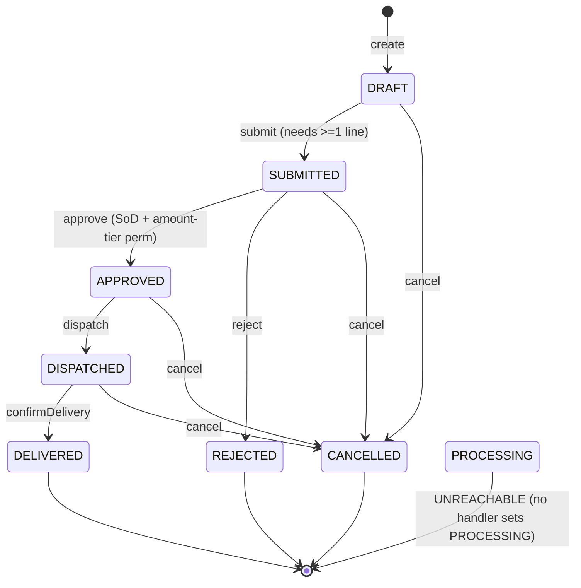
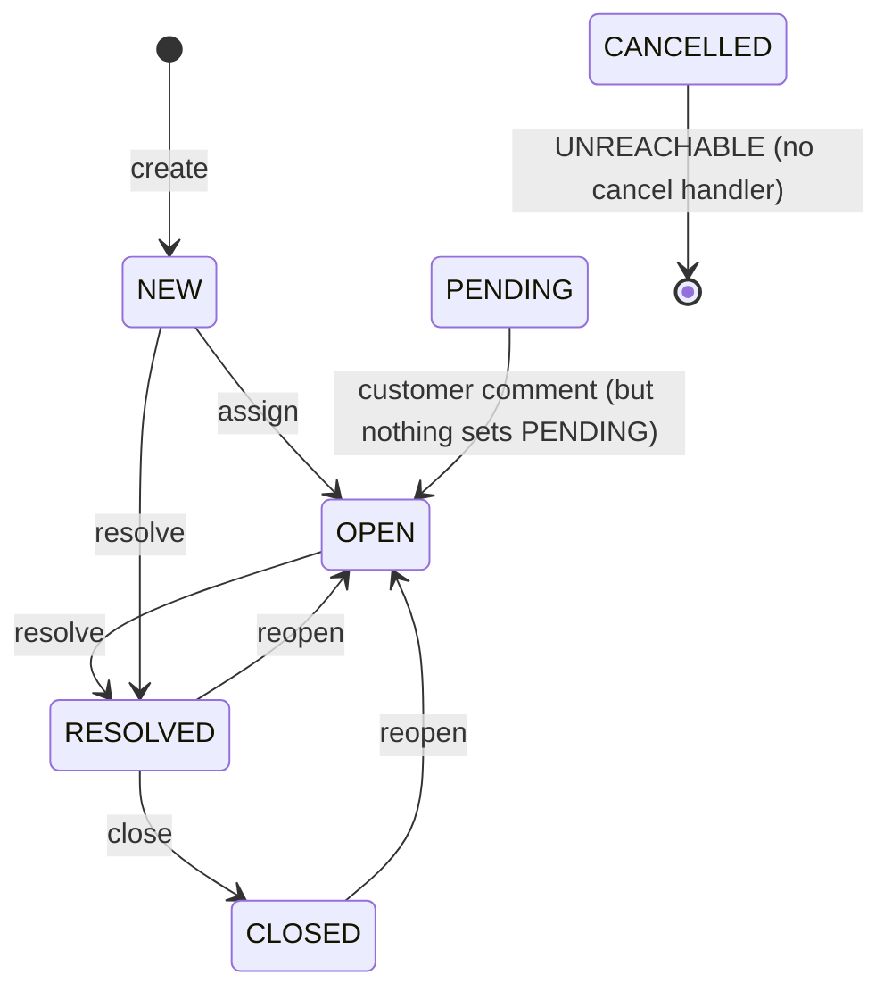
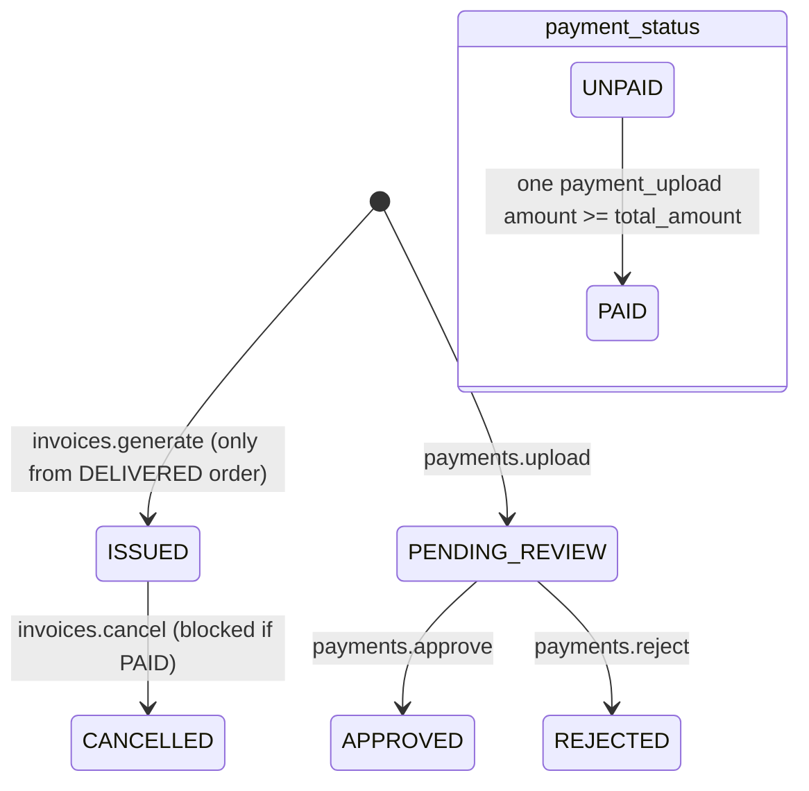

# Hass CMS, end-to-end workflow and interconnectedness audit

**Repo:** `wmurikah/hass_crm_script`  ·  **App:** Hass CMS v4.0.0 (`00_constants.gs:188`)  ·  **Runtime:** Google Apps Script (V8), data in Turso/libSQL.

This is a read-only diagnosis. No business logic, RBAC, the `processRequest` contract, `doGet` ALLOWALL, the `/exec` deployment, or the Cloudflare worker were changed. The only artifact added is this document. Every finding is located in code or schema. Live-data checks are given as read-only SQL because this environment has no `TURSO_URL`/`TURSO_TOKEN` (they live in Script Properties, `10_turso_client.gs:19-30`), so no query could be run here.

## 0. Two framing facts that change how the audit reads

1. **There are no `entity_statuses`, `status_transitions`, or `menu_items` tables in this codebase.** A repo-wide search finds those names only in two stale HTML comments (`Staffdashboard.html:106,110`). The state machine is **hardcoded inside each service handler** (for example `Orders._STATUS_FLOW_` at `40_svc_orders.gs:21`, and per-handler `if (order.status !== 'X')` guards), and the navigation menu is a **static array** `_MENU_ITEMS_` (`40_svc_menu.gs:18-40`), filtered at runtime by permission. So the requested "transitions no role can perform" and "menu_items vs role_permissions" checks are reframed against the code-level state guards and the static menu array, plus the live `role_permissions` rows (SQL in section F).

2. **The canonical DB schema is not in the repo.** `001_rebuild_schema.sql` contains only `sessions`; `002_oracle_approvals_schema.sql` only the PO/SO tables. All other tables (53 logical names in `00_constants.gs:14-103`) live in Turso and are adapted at runtime by `SchemaIntrospect` (`10_schema_introspect.gs`). Several findings below are column or table mismatches between handler SQL and the real schema; section F gives the SQL to confirm each.

---

## A. Workflow inventory and state-machine map

Each map below is what the **handlers actually enforce** (not the header-comment prose, which in several places disagrees with the code; that disagreement is itself logged as a finding).

### A.1 Orders (`40_svc_orders.gs`)



Declared flow (`40_svc_orders.gs:8`, `:21-30`): `DRAFT -> SUBMITTED -> APPROVED -> PROCESSING -> DISPATCHED -> DELIVERED`. Actual handlers skip `PROCESSING` entirely (`_dispatchHandler_` requires `APPROVED`, `40_svc_orders.gs:501`). `_STATUS_FLOW_` is never read anywhere (dead map; see ORD-1). `payment_status` is a second axis: `PENDING -> INVOICED` (set at invoice generation, `40_svc_invoices.gs:148-151`); it never advances to `PAID` (INV-3).

### A.2 Tickets (`40_svc_tickets.gs`)



Declared flow (`40_svc_tickets.gs:8`): `NEW -> OPEN -> PENDING -> RESOLVED -> CLOSED`, `Any open -> CANCELLED`. Actual: no handler ever writes `PENDING` or `CANCELLED` (TKT-4). SLA deadline columns are never populated at create (TKT-1).

### A.3 Invoices and payments (`40_svc_invoices.gs`, `40_svc_payments.gs`)



`UNPAID -> PAID` requires a **single** upload whose amount is at least the invoice total (`40_svc_invoices.gs:263`); partial payments never accumulate (INV-2). The order is never told the invoice was paid (INV-3).

### A.4 Documents / KYC (`40_svc_documents.gs`)

`PENDING_REVIEW` (upload, `:148`) -> `APPROVED` or `REJECTED` (verify, `:179`). The background expiry alert expects status `ACTIVE` (`50_jobs.gs:190`), a value no document ever holds (CUST-3). Verification never updates the customer (CUST-2).

### A.5 Approval requests (`40_svc_approvals.gs`)

`PENDING -> APPROVED | REJECTED`. **No code anywhere inserts an `approval_requests` row**, so the machine has no entry point (APR-1), and approve/reject never touch the entity the request points at (APR-2).

### A.6 Auth / onboarding (`40_svc_auth.gs`, `20_session.gs`, `20_mfa.gs`)

Staff login -> (optional MFA) -> `Session.create` -> token. Portal contact login -> token + `?page=portal`. Signup writes `signup_requests` as `PENDING_APPROVAL` and stops there (AUTH-1). Password-reset OTP is generated and stored but never delivered (AUTH-2).

### A.7 Other state-bearing records

| Record | States in code | Terminal / dead-end notes |
|---|---|---|
| `signup_requests` | `PENDING_APPROVAL` | terminal, no consumer (AUTH-1) |
| `customers` | `ACTIVE` (at create) -> `INACTIVE` (softDelete) | no reactivate path (CUST-4); never starts non-active (CUST-1) |
| `payment_uploads` | `PENDING_REVIEW -> APPROVED/REJECTED` | M-Pesa-initiated uploads can stick at `PENDING_REVIEW` (INTG-1) |
| `recurring_schedule` | `is_active=1`, `next_order_date` | no creator, no runner (REC-1, REC-2) |
| `notifications` | `PENDING` -> `READ` (by reader) | never `SENT`; no sender drains it (NOT-1) |

---

## B. Interconnectedness map

### B.1 Intended vs actual cross-entity links

```mermaid
flowchart TD
    SIGNUP[signup_requests] -. MISSING: no approval handler .-> USER[users + user_roles]
    USER --> SESSION[sessions]
    CUST[customers] --> DOC[documents/KYC]
    DOC -. MISSING: verify never updates customer .-> ONB[customer onboarding/ACTIVE]
    ORD[orders] -->|invoices.generate, manual only| INV[invoices]
    ORD -. MISSING: confirmDelivery does not auto-invoice .-> INV
    INV -->|payments.upload/approve| PAY[payment_uploads]
    PAY -->|approve, if amount>=total| INVPAID[invoice.payment_status=PAID]
    PAY -. MISSING: order.payment_status never set PAID .-> ORD
    INV -. MISSING: never enqueues eTIMS .-> ETIMS[eTIMS filing]
    TKT[tickets] -. MISSING: no SLA deadline at create .-> SLA[SLA timers]
    SLA -. MISSING: breach sweep never enqueued .-> ESC[escalation]
    REC[recurring_schedule] -. MISSING: never generates .-> ORD
    APR[approval_requests] -. MISSING: no producer; decision does not update entity .-> ORD
    EVT[business events] -. MISSING: nothing enqueues .-> NOTfrom[notifications]
    NOTfrom -. MISSING: no flush job .-> SEND[email/SMS delivery]
```

### B.2 Module link table (every link the task asked about)

| Link (from -> to) | Wired? | Evidence | Finding |
|---|---|---|---|
| order delivery -> invoice generation | **No (manual only)** | `_confirmDeliveryHandler_` `40_svc_orders.gs:519-543` only sets `DELIVERED`; invoice is a separate manual call `40_svc_invoices.gs:81` | ORD-3 |
| invoice -> eTIMS filing | **No** | nothing enqueues `ETIMS_SUBMIT`; handler `50_jobs.gs:169` only reachable from an unenqueued job | INV-1, INTG-2 |
| payment approval -> invoice PAID | **Partial + silently fragile** | `40_svc_invoices.gs:259-269`, single-payment only, swallowed | INV-2, INV-4 |
| payment approval -> order payment_status | **No** | `_paymentApprove_` never updates `orders` | INV-3 |
| signup approval -> create user + assign role | **No (no approval handler exists)** | `_authSignup_` `40_svc_auth.gs:219-240`; `signup_requests` never read | AUTH-1 |
| ticket create -> SLA timer start | **No** | `_createHandler_` `40_svc_tickets.gs:144-166` writes no `sla_*_by` | TKT-1 |
| ticket resolution -> stop SLA timer | **N/A (no timer to stop)** | `_resolveHandler_` `40_svc_tickets.gs:335`; sweep is status-gated | TKT-1, SLA-2 |
| SLA breach -> escalation/notify | **No** | `_escalateHandler_` `40_svc_tickets.gs:303` only increments a counter | TKT-3, SLA-2 |
| recurring schedule -> generate order | **No (and produces a broken order if forced)** | `_handleRecurringOrderGen_` `50_jobs.gs:207-231` never enqueued; inserts an order with no lines | REC-1/2/3 |
| approval decision -> underlying entity | **No** | `_approvalsApprove_`/`Reject_` `40_svc_approvals.gs:136-185` update only the request | APR-2 |
| customer KYC docs -> onboarding status | **No** | `_verify_` `40_svc_documents.gs:164-195` updates only the document | CUST-2 |
| business event -> notification -> channel | **No end to end** | only `notifications.send` enqueues; no flush job; `jobNotifFlush` referenced at `60_integ_notifications.gs:4` does not exist | NOT-1/2 |
| M-Pesa STK -> payment match -> approve | **Broken** | `MpesaInteg.callback` `60_integ_mpesa.gs:120` not routed in `doPost` `30_router.gs:72-99`; `initiate` has no caller; reference write swallowed | INTG-1 |
| Oracle order/customer codes -> orders | **Dormant** | `OracleInteg.pushOrder/pullInvoice` `60_integ_oracle.gs` have zero callers | INTG-3 |

---

## C. Findings register

Gap types: **DeadEnd** (status with no outbound transition, not terminal), **Orphan** (record never linked / dangling FK), **Handoff** (step A done, the step it should trigger never fires), **PermDeadEnd** (action/transition needs a permission no active role holds), **MissingAuto** (depends on a time trigger that is not installed/enqueued), **Silent** (error swallowed, user sees a hang or false success), **Disconnect** (two modules that should be wired are not).

### C.1 Background automation and triggers

| ID | Workflow | Type | Location | What hangs / user impact | Sev | Recommended fix |
|---|---|---|---|---|---|---|
| TRG-1 | all scheduled work | MissingAuto | `50_jobs.gs:43` `installAllTriggers`, `:380` `installKeepWarmTrigger`; **zero call sites** | If an operator never runs these from the IDE, no trigger exists at all: no queue drain, no daily maintenance, no keepWarm. Everything time-driven hangs forever. | High | Document a one-time setup step; optionally call `installAllTriggers()` from a guarded admin action. |
| TRG-2 | SLA, recurring, doc-expiry, eTIMS, M-Pesa, Oracle | MissingAuto | `_dispatch_` `50_jobs.gs:138-151` vs the only enqueue site `runDailyMaintenance` `50_jobs.gs:310-314` | 7 of 10 job types are never enqueued: `SLA_BREACH_SWEEP`, `RECURRING_ORDER_GEN`, `DOC_EXPIRY_ALERT`, `ETIMS_SUBMIT`, `MPESA_RECON`, `ORACLE_SYNC`, `ORACLE_APPROVALS_SYNC`. Their handlers are dead code; the workflows that rely on them hang. | High | Enqueue the periodic sweeps from the right trigger entry points, or call the handlers directly the way `runOracleApprovalsSync` already does (`50_jobs.gs:292-305`). |
| TRG-3 | SLA / approvals triggers | MissingAuto | `runSlaBreachSweep`/`runHourlyApproval` `50_jobs.gs:281-282` | Both just call `Jobs.runJobs()` (drain queue). Their names imply work they never do (SLA sweep, Oracle hourly). | Medium | Make each trigger enqueue or invoke its named handler. |

### C.2 Notifications

| ID | Workflow | Type | Location | What hangs / user impact | Sev | Recommended fix |
|---|---|---|---|---|---|---|
| NOT-1 | notifications delivery | Disconnect / MissingAuto | `60_integ_notifications.gs:4` (comment names a non-existent `jobNotifFlush`), senders `_dispatchEmail_`/`_dispatchSms_` `:22,:50` have zero callers; no `NOTIF_FLUSH` job type | Every notification row stays `PENDING` forever; no email or SMS is ever sent. Customers and staff never get notified. | High | Add a flush job type + trigger that selects `notifications WHERE status='PENDING'` and dispatches, then marks `SENT`. |
| NOT-2 | event -> notification | Disconnect | only `_notifSend_` `40_svc_notifications.gs:116` enqueues; orders/payments/tickets/approvals never call it | No business event creates a notification, so even a working sender would have nothing to send. | Medium | Emit notifications at the key handoffs (order submitted, payment approved, ticket assigned, doc expiring). |
| NOT-3 | templates | Disconnect | `notification_templates` only read by `notificationTemplates.list` `40_svc_notifications.gs:170`; never consulted on create | Templates authored via `upsert` are never used; callers hand-build subject/body. | Low | Resolve a template by event key inside `_enqueueNotification_`. |
| NOT-4 | doc-expiry recipient | Orphan | `_handleDocExpiryAlert_` enqueues `recipient_type='CUSTOMER'`, `recipient_id=customer_id` `50_jobs.gs:198`, but `_resolveRecipientEmail_` looks that id up as a `contact_id` then `customers` `60_integ_notifications.gs:96-99` | Recipient resolves to null, message silently dropped (moot until NOT-1 fixed). | Low | Resolve customer email via a contact or a `customers.email` column. |

### C.3 Orders

| ID | Workflow | Type | Location | What hangs / user impact | Sev | Recommended fix |
|---|---|---|---|---|---|---|
| ORD-1 | order state machine | Disconnect | `_STATUS_FLOW_` `40_svc_orders.gs:21-30` is never referenced | The one declarative transition map is dead; transitions are enforced by scattered string checks, so the documented flow and the real flow drift (see ORD-2). | Low | Either drive the guards from `_STATUS_FLOW_` or delete it. |
| ORD-2 | order lifecycle | DeadEnd | `PROCESSING` appears only in `_STATUS_FLOW_`; no handler sets it; `_dispatchHandler_` requires `APPROVED` `40_svc_orders.gs:501` | Any order that reaches `PROCESSING` (data import, future code) cannot be dispatched and cannot move forward; it is a non-terminal dead-end. | Medium | Either add a `processing` transition or remove the state. |
| ORD-3 | delivery -> invoice | Handoff | `_confirmDeliveryHandler_` `40_svc_orders.gs:519-543` does not create an invoice | A delivered order produces no invoice unless someone manually calls `invoices.generate`; forgotten deliveries never bill (revenue leak), order sits `DELIVERED`/`payment_status=PENDING`. | Medium | Auto-generate (or auto-enqueue) the invoice on delivery, or surface a "deliver and invoice" action. |
| ORD-4 | high-value approval | PermDeadEnd | `_approveHandler_` requires `order.approve_mid`/`order.approve_high` by amount `40_svc_orders.gs:404-408`, but the dispatcher gate and menu only use `order.approve_low` | If no active role holds `order.approve_mid`/`approve_high`, every order over the threshold is stuck in `SUBMITTED` with a permission error and no one can advance it. Confirm with SQL F.3. | High | Grant the mid/high codes to the approver roles, or collapse the tiers. |
| ORD-5 | recurring order header | Orphan | `_handleRecurringOrderGen_` `50_jobs.gs:216-219` inserts an order with no `order_number`, no totals, and no lines | A generated recurring order is a lineless, unnumbered order that fails submit-style validation and cannot be invoiced. (Also never runs, REC-2.) | Medium | Generate lines from `recurring_schedule_lines` and set number/totals. |

### C.4 Invoicing and payments

| ID | Workflow | Type | Location | What hangs / user impact | Sev | Recommended fix |
|---|---|---|---|---|---|---|
| INV-1 | invoice -> eTIMS | Handoff | invoice create `40_svc_invoices.gs:128-151` never enqueues `ETIMS_SUBMIT`; `_handleEtimsSubmit_` `50_jobs.gs:169` unreachable; `EtimsInteg.submit` never writes the eTIMS id back `60_integ_etims.gs` | Invoices are never filed to KRA; if the job were ever run it would double-submit (no idempotency / write-back). | Medium | Enqueue `ETIMS_SUBMIT` at generation and persist the returned id + status on `invoices`. |
| INV-2 | payment -> PAID | DeadEnd | `_paymentApprove_` marks PAID only if one upload amount >= total `40_svc_invoices.gs:263` | Partial or split payments never mark the invoice PAID; a fully-paid-in-two-parts invoice stays `UNPAID` forever and shows on aging. | Medium | Sum approved uploads against the total. |
| INV-3 | payment -> order | Handoff | `_paymentApprove_` `40_svc_invoices.gs:242-277` never updates `orders.payment_status` | After full payment the order still reads `payment_status=INVOICED`; order-side reporting never sees payment. | Medium | Update the linked order's payment_status on approval. |
| INV-4 | payment PAID write | Silent | `try { ... PAID ... } catch (_) {}` `40_svc_invoices.gs:259-269` | If the invoice update throws, the payment is APPROVED and the UI says success, but the invoice stays UNPAID with no error. False success on the money path. | High | Let the failure propagate, or record and retry. |
| INV-5 | payments list | Disconnect | `_paymentsList_` selects `pu.reference_number` `40_svc_payments.gs:40`, but uploads store `reference` `40_svc_invoices.gs:223,228` | If the column is `reference`, the Payments page query errors (page blank); if both exist, the reference always shows empty. | Medium | Align on one column name (SQL F.6). |

### C.5 Approvals

| ID | Workflow | Type | Location | What hangs / user impact | Sev | Recommended fix |
|---|---|---|---|---|---|---|
| APR-1 | approval inbox | Disconnect / Orphan | no `INSERT INTO approval_requests` anywhere; comment claims a producer `40_svc_approvals.gs:5` | `approvalRequests.inbox` is always empty; `approval_workflows`, tiers and escalation paths are non-functional; the Approvals page and the dashboard "pending approvals" count (`40_svc_dashboard.gs:100`, `40_svc_reports.gs:28`) always read 0. | High | Create approval_requests at the submit/credit steps, or remove the feature. |
| APR-2 | approval -> entity | Handoff | `_approvalsApprove_`/`Reject_` update only `approval_requests` `40_svc_approvals.gs:136-185` | Even if a request existed, approving it would not advance the order/credit it references (`entity_type`/`entity_id` read but never acted on). | High | On decision, update the referenced entity. |
| APR-3 | dashboards | Disconnect | pending-approval counts `40_svc_dashboard.gs:100`, `40_svc_reports.gs:28` | Managers see a permanent 0, masking real backlog (orders use the separate inline approve path). | Low | Point the count at the real backlog or remove it. |

### C.6 Tickets and SLA

| ID | Workflow | Type | Location | What hangs / user impact | Sev | Recommended fix |
|---|---|---|---|---|---|---|
| TKT-1 | SLA timer start | Handoff | `_createHandler_` `40_svc_tickets.gs:144-166` sets no `sla_response_by`/`sla_resolve_by` | The SLA clock never starts; the breach sweep `50_jobs.gs:236-240` filters on `sla_resolve_by IS NOT NULL`, so no ticket is ever flagged; `sla.listBreaches` is always empty. | High | Match an SLA policy at create and stamp the deadlines. |
| TKT-2 | ticket comment writes | Silent | first-comment `40_svc_tickets.gs:170-178` and resolution-comment `:366-374` use `created_by`/`created_by_type`; `addComment` uses `author_id`/`author_type`/`author_name` `:273-279`; both former are in `try/catch(_)` | If the live table has the `author_*` columns, the description comment and the resolution comment silently fail to persist while the handler returns success. The resolution note vanishes (summary survives on the ticket). | Medium | Standardise the column set (SQL F.7). |
| TKT-3 | escalation | Disconnect | `_escalateHandler_` `40_svc_tickets.gs:303-331` only increments `escalation_level` | Escalation does not reassign, notify, or change SLA; it is a counter with no downstream effect. | Medium | Wire escalation to reassignment + notification. |
| TKT-4 | ticket lifecycle | DeadEnd | no handler writes `PENDING` or `CANCELLED`; no cancel action registered (`40_svc_tickets.gs:479-490`) | `PENDING` and `CANCELLED` are declared but unreachable; tickets can never be cancelled. | Low | Add the missing transitions or drop them from the documented flow. |
| SLA-1 | SLA policy admin | Disconnect | `createPolicy`/`updatePolicy`/`checkEntity` read/write `sla_policies` and `sla_breaches` `40_svc_sla.gs:100,134,204,211`; those tables exist nowhere (not in schema, seed, or `00_constants.gs`); `listPolicies` itself says the real table is `sla_config` `:65` | Creating or updating an SLA policy throws ("no such table"); `sla.checkEntity` throws. SLA configuration is non-functional from the API. | High | Point all SLA handlers at the real `sla_config`/ticket-flag model. |
| SLA-2 | SLA breach detection | MissingAuto | `_handleSlaBreachSweep_` `50_jobs.gs:233-249` never enqueued (TRG-2); also depends on TKT-1 deadlines that are never set | Breaches are never detected automatically; escalation never triggers. | High | Enqueue the sweep and set deadlines at create. |
| SLA-3 | SLA admin UI | Handoff | `partial_sla.html:33,77` call `config.list`/`config.set`, which are **not registered** (registry only has `configAdmin.*` and `sla.*`) | The SLA Config page cannot load or save thresholds: every call returns `UNKNOWN_ACTION` and the UI hangs on a spinner / error. | High | Repoint the page at `sla.*` (or `configAdmin.*`). |
| SLA-4 | SLA column naming | Disconnect | `listPolicies` selects `resolve_minutes` from `sla_config` `40_svc_sla.gs:68`; `createPolicy` writes `resolution_minutes` to `sla_policies` `:100-103` | Even within the SLA service the column names disagree, so reads and (attempted) writes are incompatible. | Medium | Standardise on one column name. |

### C.7 Auth and onboarding

| ID | Workflow | Type | Location | What hangs / user impact | Sev | Recommended fix |
|---|---|---|---|---|---|---|
| AUTH-1 | signup -> user -> role | Handoff / Orphan | `_authSignup_` writes `signup_requests` `40_svc_auth.gs:226-236`; nothing reads or approves it | A self-signup sits at `PENDING_APPROVAL` forever; no user or contact is ever created and no role assigned. The whole signup-to-verified-user flow dead-ends. | High | Add a signup-review action that provisions the user/contact and assigns a role. |
| AUTH-2 | password reset | Handoff | `_authRequestPasswordReset_` generates and stores an OTP but never sends it ("we omit MailApp dependency") `40_svc_auth.gs:279` | Users requesting a reset never receive the code; self-service reset is impossible without DB access. | High | Send the OTP via `EmailInteg.send`. |
| AUTH-3 | portal profile / password | Handoff | `portal_profile.html:30,43` call `users.updateProfile` and `auth.changePassword`, neither registered | Portal "My Profile" save and password change return `UNKNOWN_ACTION`; the buttons hang. | Medium | Register the two actions (real handlers needed; recommendation only). |
| AUTH-4 | MFA enrolment UI | Handoff / PermDeadEnd | `MfaEnroll.html:42,67` call `auth.mfaEnroll`/`auth.mfaVerifyEnroll`; registry has `mfaEnrollStart`/`mfaEnrollVerify` `40_svc_auth.gs:493-494`, and `mfaEnrollStart` requires a session the mid-login user does not yet have `:342` | The standalone MFA enrolment page cannot start or verify enrolment; if MFA is required, affected staff cannot complete login. | Medium | Reconcile the enrolment endpoints and the no-session enrol case. |
| AUTH-5 | portal MFA | DeadEnd | `_authMfaVerify_` throws "not yet implemented" for non-staff `40_svc_auth.gs:377` | A portal contact with MFA required can never complete verification. | Low | Implement or explicitly disable portal MFA. |
| AUTH-6 | forced password change | Silent | `_authSetNewPassword_` swallow `40_svc_auth.gs:328-334`; fallback rewrites the hash without clearing `must_change_password` | If the swallowed error is not the assumed missing column, the flag never clears and the user is bounced back into the change-password loop, with success reported. | Medium | Inspect the error instead of blind-catching. |

### C.8 Customers and KYC

| ID | Workflow | Type | Location | What hangs / user impact | Sev | Recommended fix |
|---|---|---|---|---|---|---|
| CUST-1 | customer onboarding | Disconnect | `_createHandler` sets `status:'ACTIVE'` immediately `40_svc_customers.gs:180` | There is no onboarding state machine (no PROSPECT/PENDING/KYC gate); KYC documents never gate the ability to transact. The "create -> KYC -> verify -> onboard -> active" lifecycle in the brief is not implemented. | Medium | Introduce an onboarding status if KYC gating is intended. |
| CUST-2 | KYC -> customer | Handoff | `_verify_` updates only the document `40_svc_documents.gs:181-187` | Approving or rejecting KYC never changes the customer; onboarding can never complete (or fail) off the back of documents. | Medium | Roll document state up to a customer KYC/onboarding status. |
| CUST-3 | doc expiry reminders | Disconnect | `_handleDocExpiryAlert_` queries `documents WHERE status='ACTIVE'` `50_jobs.gs:190`; documents are only ever `PENDING_REVIEW`/`APPROVED`/`REJECTED` | Even when run (it is not, TRG-2), the query matches nothing because no document is `ACTIVE`. Expiry reminders never fire. | Medium | Query `APPROVED` (or the real "active" value) and enqueue the job. |
| CUST-4 | customer reactivation | DeadEnd | `softDelete` -> `INACTIVE` `40_svc_customers.gs:250`; `update` allow-list excludes `status` `:212-216` | A soft-deleted customer cannot be reactivated through the API. | Low | Add a reactivate action. |
| CUST-5 | credit control | Disconnect | `setCredit` sets the limit `40_svc_customers.gs:333`; order create never reads `credit_limit`/`credit_used` `40_svc_orders.gs:153-245` | Credit limits are decorative; orders are never blocked or credit consumed. | Low | Enforce credit at order submit if intended. |

### C.9 Recurring orders

| ID | Workflow | Type | Location | What hangs / user impact | Sev | Recommended fix |
|---|---|---|---|---|---|---|
| REC-1 | schedule creation | Orphan / Disconnect | no handler or UI creates `recurring_schedule`; `recurring_schedule_lines` is never written anywhere | There is no way to set up a recurring order; the feature has no entry point. | Medium | Add schedule CRUD. |
| REC-2 | schedule -> order | MissingAuto | `RECURRING_ORDER_GEN` never enqueued (TRG-2) | Even if a schedule existed, no order is ever generated. | High | Enqueue/invoke the generator. |
| REC-3 | generated order shape | Orphan | `_handleRecurringOrderGen_` `50_jobs.gs:216-219` (see ORD-5) | Generated orders have no lines and no totals. | Medium | Populate from schedule lines. |

### C.10 Integrations

| ID | Workflow | Type | Location | What hangs / user impact | Sev | Recommended fix |
|---|---|---|---|---|---|---|
| INTG-1 | M-Pesa | Silent / Handoff | `callback` not routed in `doPost` `30_router.gs:72-99`; `initiate` has no caller; reference write swallowed `60_integ_mpesa.gs:108-114`; `reconcile` never enqueued | A real STK payment can be charged while the `payment_uploads` row stays `PENDING_REVIEW` with no recovery: the callback never runs, the match key may be lost, and reconcile never runs. | High | Route the callback, enqueue reconcile, and stop swallowing the reference write. |
| INTG-2 | eTIMS | Handoff | see INV-1; `EtimsInteg.submit` logs `ETIMS_SUBMITTED` but never writes back `60_integ_etims.gs:71-83` | Invoices never reach KRA; re-runs double-submit. | Medium | Enqueue + write back + dedupe. |
| INTG-3 | Oracle order/invoice | Disconnect | `OracleInteg.pushOrder`/`pullInvoice` `60_integ_oracle.gs:103,118` have zero callers; `pushOrder` stores no Oracle id | Oracle order/customer/invoice code sync is dormant; orders never carry an Oracle id. | Medium | Wire push on approve/dispatch and persist the returned id. |
| INTG-4 | Teams / Twilio / WhatsApp | Disconnect | real clients, zero callers (`60_integ_teams.gs`, `60_integ_twilio.gs`, `60_integ_whatsapp.gs`) | Production-looking comms channels are never invoked by any workflow. | Low | Wire into the notification sender (NOT-1) or remove. |
| INTG-5 | Oracle approvals pull | MissingAuto (by design) | `OracleApprovalsConnector.fetchExtracts` deliberately throws `60_integ_oracle_approvals.gs:421`; scheduled pull no-ops `50_jobs.gs:292-305` | The PO/SO analytics live-pull is intentionally stubbed; upload + webhook paths work. Acceptable, noted so it is not mistaken for a bug. | Low | Implement the connector when EBS connectivity exists. |

### C.11 Action coverage and permissions

| ID | Workflow | Type | Location | What hangs / user impact | Sev | Recommended fix |
|---|---|---|---|---|---|---|
| ACT-1 | UI -> unregistered actions | Handoff | `config.list`/`config.set` (`partial_sla.html:33,77`), `users.updateProfile`/`auth.changePassword` (`portal_profile.html:30,43`), `auth.mfaEnroll`/`auth.mfaVerifyEnroll` (`MfaEnroll.html:42,67`) | Each returns `UNKNOWN_ACTION` (`30_dispatcher.gs:53-55`); the calling screen hangs on a spinner or shows an error with no path forward. | High | Register the actions (real handlers) or repoint the UI. |
| ACT-2 | registered but UI-dead | Disconnect | no partial calls `sla.*`, `notifications.*`, `notificationTemplates.*`, `localization.*`, `delivery_locations.*`, `contacts.setPortalRole`, `customers.customer360`, `auth.getStaffInfo` | These handlers are reachable only by the bot/tests; the SLA and notifications services in particular are dead on both ends. | Low | Wire or retire; confirm none are bot-only before removing. |
| PERM-1 | high-value order approval | PermDeadEnd | see ORD-4 | mid/high orders frozen if no role holds the codes. | High | SQL F.3, then grant. |
| PERM-2 | customer permission families | PermDeadEnd | singular `customer.view`/`customer.manage` (catalog/documents/delivery_locations) vs plural `customers.*` (customers svc) vs `contacts.manage`; menu mixes both `40_svc_menu.gs:20,29` | If `role_permissions` does not define and grant all families, the affected screens are reachable only by SUPER_ADMIN's `*`; ordinary roles see permission errors. | Medium | SQL F.4; reconcile naming or grant both. |
| PERM-3 | public actions drift | Disconnect | duplicate `_PUBLIC_ACTIONS_` (`30_dispatcher.gs:6` vs `40_svc_auth.gs:71`); the auth copy wins and drops `system.ping`/`system.health` from public | Health/ping are session-gated despite `40_svc_system.gs:8` calling ping public; uptime probes get `NO_SESSION`. | Low | Single source of truth for public actions. |

### C.12 Miscellaneous schema or data mismatches

| ID | Type | Location | Impact | Sev | Fix |
|---|---|---|---|---|---|
| MISC-1 | Disconnect | `PK.po_approvals = 'po_number'` `00_constants.gs:146` vs real PK `purchase_number` `002_oracle_approvals_schema.sql:26` | Any `Repo` call on `po_approvals` would target a non-existent PK column; the analytics code uses raw SQL so it is not hit today, but the constant is wrong. | Low | Correct the PK constant. |
| MISC-2 | Disconnect | `sessions` schema `001_rebuild_schema.sql:12-26` (`last_active_at`/`ip`/`ua`, no `idle_timeout_minutes`) vs code (`last_activity_at`/`ip_address`/`user_agent`/`idle_timeout_minutes`, `20_session.gs`) | The reference DDL is stale; harmless at runtime (live schema differs) but misleading. | Low | Refresh the reference DDL. |

---

## D. Required checks, explicit results

So that each requested check is visible in one place:

- **Action coverage (UI call strings vs dispatcher registry).** UI calls were extracted from every `*.html` (`API.call(svc,action)`), the registry from every `register({...})` in `*.gs`. UI calls to **unregistered** actions (these hang the UI): `config.list`, `config.set`, `users.updateProfile`, `auth.changePassword`, `auth.mfaEnroll`, `auth.mfaVerifyEnroll` (ACT-1). Registered actions with **no UI caller** (dead from the UI): the `sla.*`, `notifications.*`, `notificationTemplates.*`, `localization.*`, `delivery_locations.*` families plus `contacts.setPortalRole`, `customers.customer360`, `auth.getStaffInfo`, `system.ping/dbStats/version` (ACT-2). Every handler in the registry has a function; no registered action lacks a handler.
- **Menu and permission.** Menu is the static `_MENU_ITEMS_` array; each item's permission equals the destination's list-action gate (verified against the registry, consistent). Whether any active role can actually see each item depends on `role_permissions` (live): SQL F.4/F.5. The high-risk dual-family case is PERM-2; the high-value approval gate is PERM-1/ORD-4.
- **State machine.** Maps in section A. Non-terminal dead-ends / unreachable states: order `PROCESSING` (ORD-2), ticket `PENDING`/`CANCELLED` (TKT-4). Transitions pointing at states no handler sets: the declared order/ticket flows vs the real guards (ORD-1, TKT-4). Statuses used in code but never produced: document `ACTIVE` expected by the expiry job (CUST-3).
- **Handoffs.** Each cross-entity handoff is in B.2 with a verified yes/no. Confirmed broken: delivery->invoice (ORD-3), payment->order (INV-3), payment->invoice-PAID partial/silent (INV-2/INV-4), signup->user/role (AUTH-1), ticket->SLA start (TKT-1), recurring->order (REC-2), approval->entity (APR-2), KYC->onboarding (CUST-2), invoice->eTIMS (INV-1).
- **Triggers.** Expected set: `_TRIGGERS_` `50_jobs.gs:26-41` plus `keepWarm`. Actually installed by code: none (installers are never called, TRG-1). Even when installed, only 3 of 10 job types are ever enqueued (TRG-2).
- **Notifications.** Emitters, sender, templates and recipient resolution in C.2: no sender drains the queue (NOT-1), no event emits (NOT-2), templates unused (NOT-3).
- **Silent failures.** Money/auth-path swallows that produce a false success: INV-4, INTG-1, AUTH-6, TKT-2. The pervasive scope-resolution and history/audit/cache swallows elsewhere are deliberately fail-closed or best-effort (they do not report false success); they are noted but not raised as defects.
- **Integration stubs.** C.10: M-Pesa (INTG-1), eTIMS (INTG-2), Oracle order/invoice (INTG-3), Teams/Twilio/WhatsApp dormant (INTG-4), Oracle approvals connector deliberately stubbed (INTG-5). `integration_log` records failures on the real connectors; `job_queue` retry exists but is not fed for these types (TRG-2).

---

## E. Prioritised remediation list

Ordered by severity then effort (low effort first within a tier). IDs link to the register.

**High severity**

1. **TRG-1 / TRG-2 / TRG-3 (install + enqueue the jobs).** Low-to-medium effort, unblocks SLA, recurring, doc-expiry, eTIMS, M-Pesa and Oracle at once. This is the single highest-leverage fix: most "hangs forever" findings trace back here.
2. **SLA-3 / ACT-1 (repoint UI to registered actions).** Low effort, removes hard UI hangs on the SLA, portal-profile and MFA-enrol screens.
3. **INV-4 / AUTH-6 (stop swallowing money/auth writes).** Low effort, removes false-success on payment and password reset.
4. **AUTH-2 (send the reset OTP).** Low effort, makes self-service reset real.
5. **AUTH-1 (signup approval handler).** Medium effort, restores the onboarding chain.
6. **SLA-1 / TKT-1 (point SLA at real tables, stamp deadlines at create).** Medium effort, makes SLA functional end to end.
7. **APR-1 / APR-2 (produce approval_requests and act on the entity), or retire the module.** Medium effort or low if retired.
8. **INTG-1 (M-Pesa callback + reconcile + reference).** Medium effort, prevents lost payments.
9. **PERM-1 / ORD-4 (grant mid/high approval codes).** Data fix after SQL F.3.

**Medium severity**

10. ORD-3 (auto-invoice on delivery), INV-1/INTG-2 (eTIMS enqueue + write-back), INV-2 (sum payments), INV-3 (order payment_status), INV-5 (reference column), TKT-2 (comment columns), TKT-3 (escalation effects), ORD-2 (PROCESSING), CUST-1/CUST-2/CUST-3 (KYC onboarding + expiry), REC-1/REC-3 (schedule CRUD + line generation), NOT-1/NOT-2 (notification sender + emitters), AUTH-3/AUTH-4 (portal profile + MFA enrol), SLA-4 (column naming), INTG-3 (Oracle push), PERM-2 (permission families).

**Low severity**

11. ORD-1, TKT-4, AUTH-5, CUST-4, CUST-5, APR-3, NOT-3, NOT-4, ACT-2, PERM-3, INTG-4, INTG-5, MISC-1, MISC-2.

---

## F. Live-data checks, exact read-only SQL

Run against Turso (read only). Replace `:days` literals as noted. None of these writes.

### F.1 Referential integrity and orphans

```sql
-- Orders with no lines (cannot be invoiced; recurring-generated orders land here)
SELECT o.order_id, o.status, o.created_at
FROM orders o
LEFT JOIN order_lines ol ON ol.order_id = o.order_id
WHERE ol.line_id IS NULL;

-- Invoices whose order is missing
SELECT i.invoice_id, i.order_id
FROM invoices i
LEFT JOIN orders o ON o.order_id = i.order_id
WHERE i.order_id IS NOT NULL AND o.order_id IS NULL;

-- Payment uploads whose invoice is missing
SELECT p.upload_id, p.invoice_id
FROM payment_uploads p
LEFT JOIN invoices i ON i.invoice_id = p.invoice_id
WHERE i.invoice_id IS NULL;

-- Approval requests whose referenced entity no longer exists (orders example)
SELECT ar.request_id, ar.entity_type, ar.entity_id
FROM approval_requests ar
LEFT JOIN orders o ON o.order_id = ar.entity_id
WHERE ar.entity_type = 'ORDER' AND o.order_id IS NULL;

-- user_roles pointing at a missing user, or a missing role
SELECT ur.id, ur.user_id, ur.role_code
FROM user_roles ur
LEFT JOIN users u ON u.user_id = ur.user_id
WHERE u.user_id IS NULL;
SELECT ur.id, ur.user_id, ur.role_code
FROM user_roles ur
LEFT JOIN roles r ON r.role_code = ur.role_code
WHERE r.role_code IS NULL;

-- Users with no role at all (login defaults them to CS_AGENT, 40_svc_auth.gs:155)
SELECT u.user_id, u.email
FROM users u
LEFT JOIN user_roles ur ON ur.user_id = u.user_id
WHERE ur.id IS NULL;

-- Documents / contacts / orders / tickets / invoices pointing at a missing customer
SELECT d.document_id FROM documents d LEFT JOIN customers c ON c.customer_id = d.customer_id WHERE c.customer_id IS NULL;
SELECT ct.contact_id FROM contacts ct LEFT JOIN customers c ON c.customer_id = ct.customer_id WHERE c.customer_id IS NULL;
SELECT o.order_id FROM orders o LEFT JOIN customers c ON c.customer_id = o.customer_id WHERE c.customer_id IS NULL;
SELECT t.ticket_id FROM tickets t LEFT JOIN customers c ON c.customer_id = t.customer_id WHERE c.customer_id IS NULL;
SELECT i.invoice_id FROM invoices i LEFT JOIN customers c ON c.customer_id = i.customer_id WHERE c.customer_id IS NULL;

-- Full engine-level FK check (PRAGMA foreign_keys is ON per request, 10_turso_client.gs:65)
PRAGMA foreign_key_check;
```

### F.2 Stuck / non-terminal records

```sql
-- Orders stuck in a non-terminal status older than 7 days
SELECT status, COUNT(*) n, MIN(created_at) oldest
FROM orders
WHERE status IN ('DRAFT','SUBMITTED','APPROVED','PROCESSING','DISPATCHED')
  AND created_at < datetime('now','-7 days')
GROUP BY status;

-- Any order ever in PROCESSING (the unreachable/dead-end state, ORD-2)
SELECT order_id, created_at FROM orders WHERE status = 'PROCESSING';

-- Invoices unpaid past due date
SELECT invoice_id, total_amount, due_date
FROM invoices
WHERE status != 'CANCELLED' AND payment_status != 'PAID' AND due_date < date('now');

-- Payment uploads stuck pending review (incl. M-Pesa, INTG-1) older than 2 days
SELECT upload_id, invoice_id, amount, created_at
FROM payment_uploads
WHERE status = 'PENDING_REVIEW' AND created_at < datetime('now','-2 days');

-- Tickets open and old (proxy for SLA breach, since timers never start, TKT-1)
SELECT ticket_id, priority, created_at
FROM tickets
WHERE status IN ('NEW','OPEN') AND created_at < datetime('now','-3 days');

-- Approval requests pending (expected to be zero given APR-1; non-zero means a producer exists somewhere)
SELECT COUNT(*) pending_approvals FROM approval_requests WHERE status = 'PENDING';

-- Documents pending verification, and any in the 'ACTIVE' status the expiry job expects (CUST-3)
SELECT status, COUNT(*) n FROM documents GROUP BY status;

-- Signup requests that were never processed (expected: all of them, AUTH-1)
SELECT request_id, email, status, submitted_at FROM signup_requests WHERE status = 'PENDING_APPROVAL';
```

### F.3 Permission dead-ends (PERM-1 / ORD-4)

```sql
-- Which active roles (if any) can approve mid/high value orders?
SELECT rp.role_code, rp.permission_code
FROM role_permissions rp
JOIN roles r ON r.role_code = rp.role_code AND r.is_active = 1
WHERE rp.permission_code IN ('order.approve_mid','order.approve_high','*');
-- If this returns no row other than the SUPER_ADMIN '*', every order over
-- 100,000 (mid) / 1,000,000 (high) KES is unapprovable and stuck SUBMITTED.
```

### F.4 Permission family coverage (PERM-2)

```sql
-- Do both the singular and plural customer permission families exist as codes?
SELECT permission_code FROM permissions
WHERE permission_code IN
 ('customer.view','customer.manage','customers.view','customers.create',
  'customers.edit','customers.set_credit','contacts.manage');

-- Which roles hold each? (empty for a family => that screen is SUPER_ADMIN-only)
SELECT permission_code, GROUP_CONCAT(role_code) roles
FROM role_permissions
WHERE permission_code IN
 ('customer.view','customer.manage','customers.view','customers.create',
  'customers.edit','customers.set_credit','contacts.manage')
GROUP BY permission_code;
```

### F.5 Menu visibility (every `_MENU_ITEMS_` permission vs roles)

```sql
-- For each menu permission, list the active roles that can see the item.
-- Menu codes (40_svc_menu.gs): order.view, customers.view, ticket.view,
-- invoice.view, order.approve_low, order.manage, customer.view, user.view.
SELECT rp.permission_code, GROUP_CONCAT(DISTINCT rp.role_code) roles
FROM role_permissions rp
JOIN roles r ON r.role_code = rp.role_code AND r.is_active = 1
WHERE rp.permission_code IN
 ('order.view','customers.view','ticket.view','invoice.view',
  'order.approve_low','order.manage','customer.view','user.view')
GROUP BY rp.permission_code;

-- Confirm the wildcard grant the whole model depends on still exists
SELECT * FROM role_permissions WHERE permission_code = '*';
```

### F.6 Schema verification for the column mismatches

```sql
-- INV-5: does payment_uploads have 'reference' or 'reference_number' (or both)?
PRAGMA table_info(payment_uploads);

-- TKT-2: which author columns does ticket_comments actually have?
PRAGMA table_info(ticket_comments);

-- SLA-1/SLA-4: confirm sla_policies/sla_breaches do NOT exist and sla_config columns
SELECT name FROM sqlite_master WHERE type='table' AND name IN ('sla_policies','sla_breaches','sla_config','sla_data');
PRAGMA table_info(sla_config);

-- CUST-3: confirm the document status vocabulary in use
SELECT DISTINCT status FROM documents;
```

### F.7 Confirm the orphan modules have no rows arriving

```sql
-- Recurring (REC-1): are there any schedules or schedule lines at all?
SELECT COUNT(*) schedules FROM recurring_schedule;
SELECT COUNT(*) schedule_lines FROM recurring_schedule_lines;

-- Notifications (NOT-1): how many are stuck PENDING and how old?
SELECT status, COUNT(*) n, MIN(created_at) oldest FROM notifications GROUP BY status;

-- Approval workflows (APR-1): is the workflow table empty?
SELECT COUNT(*) workflows FROM approval_workflows;
```

---

## G. Safe-fix note (intentionally none applied)

The brief permits an optional, clearly separated set of trivially safe, additive, reversible fixes. After review, **no code change is included in this PR**, by design:

- Registering the UI-called-but-unregistered actions (ACT-1: `users.updateProfile`, `auth.changePassword`, `auth.mfaEnroll`, `auth.mfaVerifyEnroll`, `config.list`, `config.set`) is **not** additive-only: each needs real handler logic, the MFA enrol case also has a no-session problem (AUTH-4), and wiring a stub could mask the underlying defect. These change behaviour, so per the boundary they remain recommendations.
- There is no `status_transitions` table to add a row to (framing fact 0.1), so the suggested "add a missing transition row" class of safe fix does not apply here; the equivalent (order `PROCESSING`, ticket `PENDING`/`CANCELLED`) requires editing handler logic, which is a behaviour change.

Holding the PR to this document keeps the diagnosis non-destructive and leaves every behavioural change as an explicit, reviewable recommendation in the register above.
